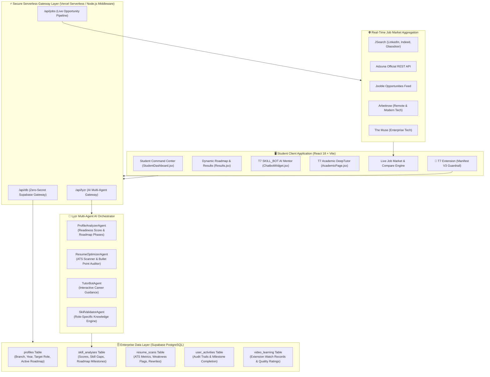

# 🚀 T7 Learning Hub

### Enterprise Career Orchestration & AI-Powered Placement Readiness Engine

> **Bridging the graduate employability gap through role-first multi-agent AI auditing, live industry job market pipelines, and autonomous learning guardrails.**

---

<p align="center">
  
  
  
  
  
  
  
  
</p>

---

<p align="center">
  🌐 <strong>Live Production Platform:</strong> <a href="https://t7skillup.vercel.app" target="_blank">https://t7skillup.vercel.app</a><br/>
  🎥 <strong>System Walkthrough:</strong> <a href="https://youtu.be/ii0ZhFK8xOU?si=r9UxTAMu5Z9MLDtn" target="_blank">Watch on YouTube</a>
</p>

---

## 📌 Executive Overview & Problem Statement

Every year, **over 1.5 million engineering and computer application students graduate in India**, yet industry benchmarks consistently show that **only ~45% meet initial technical hiring standards**. 

### ⚠️ The Root Causes:
1. **The Academic Latency Gap**: University curricula update on multi-year cycles, whereas production engineering tech stacks and hiring criteria evolve every quarter.
2. **Passive Tutorial Consumption**: Students spend hundreds of hours watching fragmented tutorials without milestone-driven validation or portfolio integration.
3. **The Final-Semester Blindspot**: Students often discover skill deficiencies only during final-year campus placement rounds when remediation time is minimal.

**T7 Learning Hub** solves this challenge through an end-to-end ecosystem combining:
* **Role-Anchored Multi-Agent AI Auditing** (via Lyzr AI Framework)
* **Deterministic Skill Gap Diagnostics** across 9 specialized computer science and engineering disciplines
* **Live Job Market Intelligence** ingested from 5 real-time career platforms
* **Autonomous Focus Guardrails** powered by a companion Manifest V3 Chrome Extension

---

## 🏗️ Enterprise System Architecture



---

## 🎯 9 Core Technical Disciplines & Placement Tracks

T7 Learning Hub is explicitly calibrated around **9 high-demand computer science, software, and computational disciplines**. Unrelated branches and generic roles have been removed to ensure rigorous hiring-bar alignment:

```
├── 1. Computer Science Engineering
│   ├── Software Development Engineer (SDE) / Backend Developer
│   ├── Frontend Developer
│   ├── Full Stack Developer
│   ├── Mobile App Developer (Android/iOS)
│   ├── DevOps Engineer
│   ├── QA / SDET (Software Development Engineer in Test)
│   └── Systems Engineer
├── 2. Information Technology
│   ├── Software Developer
│   ├── IT Support / Systems Administrator
│   ├── Network Engineer
│   ├── Database Administrator (DBA)
│   ├── IT Business Analyst
│   └── QA Engineer
├── 3. Artificial Intelligence & Machine Learning
│   ├── Machine Learning Engineer
│   ├── AI Research Engineer
│   ├── Computer Vision Engineer
│   ├── NLP Engineer
│   ├── MLOps Engineer
│   └── Deep Learning Engineer
├── 4. Data Science
│   ├── Data Analyst
│   ├── Data Scientist
│   ├── Business Intelligence (BI) Analyst
│   ├── Data Engineer
│   ├── Analytics Consultant
│   └── Quantitative Analyst
├── 5. Cyber Security
│   ├── SOC Analyst (Security Operations Center)
│   ├── Penetration Tester / Ethical Hacker
│   ├── Application Security Engineer
│   ├── Cloud Security Engineer
│   ├── Security Consultant
│   └── Incident Response Analyst
├── 6. Cloud Computing
│   ├── Cloud Engineer (AWS/Azure/GCP)
│   ├── Cloud Solutions Architect
│   ├── Site Reliability Engineer (SRE)
│   ├── DevOps Engineer
│   ├── Cloud Security Engineer
│   └── Platform Engineer
├── 7. Mathematics & Computing
│   ├── Quantitative Analyst / Quant Developer
│   ├── Data Scientist
│   ├── Backend Developer
│   ├── Research Analyst
│   ├── Actuarial Analyst
│   └── Algorithm Engineer
├── 8. MCA (Master of Computer Applications)
│   ├── Software Developer
│   ├── Full Stack Developer
│   ├── Systems Analyst
│   ├── Database Developer
│   ├── Application Developer
│   └── QA Engineer
└── 9. BCA (Bachelor of Computer Applications)
    ├── Junior Software Developer
    ├── Web Developer
    ├── IT Support Analyst
    ├── QA Tester
    ├── Systems Analyst (Entry-Level)
    └── Technical Support Engineer
```

### Context-Calibrated Evaluation Logic:
* **Degree Level Calibration:** A BCA candidate is evaluated on strong foundations (clean JavaScript/Python, basic SQL, web UI, algorithmic reasoning), whereas an MCA or CSE graduate is evaluated on distributed systems, enterprise architecture, and production readiness.
* **Specialized Domain Expectations:** Cyber Security audits check for practical lab experience (TryHackMe, OWASP, Wireshark, SIEM) and certifications (Security+, CEH); Cloud Computing audits prioritize infrastructure as code (Terraform, Docker, Kubernetes) and multi-cloud architectures.

---

## 🤖 Multi-Agent AI Framework (Powered by Lyzr)

The platform has migrated from monolithic prompt completions to a **decoupled multi-agent architecture** managed through serverless functions:

### 1. `ProfileAnalyzerAgent`
* **Purpose:** Evaluates academic profile, self-declared skills, and resume PDF against verified role standards.
* **Scoring Dimensions:**
  * **Technical Skill Match (40%):** Exact overlap with high-priority role requirements.
  * **Resume Quality & ATS Compatibility (25%):** Quantifiable metrics, action verbs, clear formatting.
  * **Market Hiring Bar (20%):** Tier-1/Tier-2 benchmark difficulty index.
  * **Profile Completeness (15%):** Projects, degree timeline, credentials.
* **Output:** Generates a structured multi-phase learning roadmap, quick-win action items, and missing skill priority rankings.

### 2. `ResumeOptimizerAgent`
* **Purpose:** Performs in-depth technical resume auditing.
* **Capabilities:** Extracts technical keywords, identifies recruiter red flags, and rewrites passive bullet points into high-impact statements using Google's **Action Verb + Context + Quantified Metric** formula.

### 3. `TutorBotAgent` (T7 SKILL_BOT)
* **Purpose:** Context-aware interactive student mentor.
* **Capabilities:** Maintains session memory, answers technical questions, clarifies roadmap steps, and guides students toward high-yield learning resources.

### 4. `SkillValidatorAgent`
* **Purpose:** Dynamic quiz and badge engine.
* **Capabilities:** Formulates role-calibrated technical assessments to validate competencies before awarding verified profile badges.

---

## 💼 Live Job Market Aggregation & "Compare & Plan"

T7 Learning Hub ingests and standardizes active job postings across **5 major employment feeds**:
* **JSearch API:** Aggregates live listings from LinkedIn, Indeed, Glassdoor, and Google for Jobs.
* **Adzuna Official API:** Enterprise employment index with geographic salary metrics.
* **Jooble API:** Global tech opportunities search.
* **Arbeitnow API:** Remote-first engineering positions.
* **The Muse API:** Verified company profiles and technical openings.

### "Compare & Plan" Interactive Matrix:
* **`✅ Skills You Have`:** Highlights requirements in the posting already satisfied by the student's profile.
* **`❌ Skills Missing`:** Identifies employer requirements absent from the student's profile. Clicking any skill instantly launches verified YouTube tutorial playlists.
* **`📈 Projected Match Jump`:** Calculates real-time readiness boost upon acquiring the target skill.

---

## 🧩 T7 Chrome Extension (Manifest V3)

A companion Chrome Extension designed to eliminate distraction and turn video consumption into verified academic credits:
* **Algorithmic Blocker:** Suppresses YouTube Shorts, sidebar recommendations, and clickbait during active learning sessions.
* **Watch Time Verification:** Tracks active, in-tab video study duration and syncs metrics directly to Supabase via the student's **T7 ID**.
* **Content Quality Scorer:** Uses automated evaluation heuristics to rate video educational depth and relevance.

---

## 🔒 Enterprise Zero-Trust Security Model

* **Zero Client Secrets:** Sensitive API keys (`LYZR_API_KEY`, `SUPABASE_SERVICE_ROLE_KEY`, `RAPIDAPI_KEY`, `ADZUNA_APP_KEY`, `JOOBLE_API_KEY`) are stored strictly in server-side environment variables and are never bundled into client JavaScript.
* **Serverless Gateways:** All database and AI requests flow through `/api/db` and `/api/lyzr`, enforcing payload validation and sanitization.
* **Local Vite Proxy:** In local development, `vite.config.js` simulates production serverless routes via custom Node.js middleware, allowing local `.env` variables to function identically to production Vercel edge environments.

---

## 🧰 Technology Stack

| Domain | Technologies |
| :--- | :--- |
| **Frontend UI** | React 18.2, Vite 5.0, Tailwind CSS 3.4, Lucide React, Modern Vanilla CSS |
| **Routing** | React Router v6 (v7 Future Flags enabled) |
| **AI Multi-Agent System**| Lyzr AI Agent Framework (`https://agent.lyzr.ai`) |
| **Database & Auth** | Supabase Enterprise PostgreSQL, Row Level Security, Secure Service Gateway |
| **Serverless Architecture**| Vercel Serverless Functions (`/api/*`), Node.js HTTP Proxies |
| **Job Market APIs** | JSearch (RapidAPI), Adzuna REST API, Jooble API, Arbeitnow API, The Muse API |
| **Browser Extension**| Chrome Extensions Manifest V3, Content Scripts, Background Service Workers |
| **Build & Tooling** | Rollup, PostCSS, Autoprefixer, ES Modules |

---

## ⚙️ Local Development Setup

### 1. Clone the Repository
```bash
git clone https://github.com/BLITZz-bot/T7_LearningHub.git
cd T7-Learning-Hub
```

### 2. Install Dependencies
```bash
npm install
```

### 3. Configure Environment Variables
Create a `.env` file in the project root based on `.env.example`:

```env
# --- DeepTutor / Academic Mode ---
VITE_DEEPTUTOR_URL=http://localhost:3782

# --- LYZR AI AGENTS (Server-Only — https://agent.lyzr.ai) ---
LYZR_API_KEY=your_lyzr_api_key_here
LYZR_AGENT_PROFILE=your_profile_analyzer_agent_id
LYZR_AGENT_RESUME=your_resume_optimizer_agent_id
LYZR_AGENT_TUTOR=your_tutor_agent_id
LYZR_AGENT_VALIDATOR=your_skill_validator_agent_id

# --- LIVE JOB MARKET AGGREGATORS (Server-Only) ---
RAPIDAPI_KEY=your_rapidapi_key_here
ADZUNA_APP_ID=your_adzuna_app_id_here
ADZUNA_APP_KEY=your_adzuna_app_key_here
JOOBLE_API_KEY=your_jooble_api_key_here

# --- SUPABASE ENTERPRISE DATABASE (Server-Only) ---
SUPABASE_URL=https://your-project-id.supabase.co
SUPABASE_SERVICE_ROLE_KEY=your_supabase_service_role_key_here
SUPABASE_ANON_KEY=your_supabase_anon_key_here
```

### 4. Start Development Server
```bash
npm run dev
```
The application will launch at `http://localhost:3000`.

### 5. Validate Production Build
```bash
npm run build
```

---

## 🧩 Installing the Chrome Extension

1. Open Google Chrome and navigate to `chrome://extensions/`.
2. Enable **Developer mode** via the top-right toggle.
3. Click **Load unpacked** and select the `T7extension/` folder from this repository.
4. Copy your **T7 ID** from your Student Profile on the dashboard and paste it into the extension popup to link session tracking.

---

## 👥 Engineering & Research Team

* **Abhishek** — *Lead Architect & Extension Developer*
* **Nithelan** — *Frontend & UX Specialist*
* **Bharath** — *AI & Systems Engineer*
* **Abdul** — *Data Scientist & Research*

---

<p align="center">
  <strong>🏆 Developed at Nagarjuna College of Engineering and Technology</strong><br/>
  <em>Empowering engineering students with industry-validated career readiness.</em>
</p>
