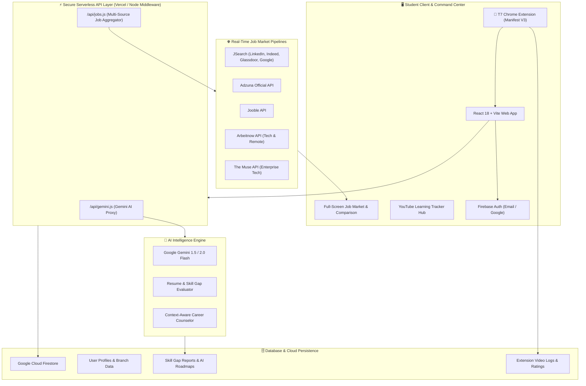

# 🚀 T7 Learning Hub

### The Intelligent Career Orchestration & Real-Time Skill Matching Engine

> **Bridging the 45% Graduate Employability Gap through Semantic AI Analysis, Multi-Source Live Job Market Pipelines, and Autonomous Learning Guardrails.**

---

<p align="center">
  
  
  
  
  
  
  
  
</p>

---

<p align="center">
  🌐 <strong>Live Production Platform:</strong> <a href="https://t7skillup.vercel.app" target="_blank">https://t7skillup.vercel.app</a><br/>
  🎥 <strong>System Demo:</strong> <a href="https://youtu.be/ii0ZhFK8xOU?si=r9UxTAMu5Z9MLDtn" target="_blank">Watch on YouTube</a>
</p>

---

## 📌 Vision & Problem Statement

Every year, **1.5+ million engineering students graduate in India**, yet **only ~45% meet industry employability benchmarks**. 

### ⚠️ The Core Bottlenecks:
1. **The Semantic Syllabi Gap**: University curricula update every 3–4 years, while tech industry job requirements evolve every 3–4 months.
2. **The Passive Learning Trap**: Over 70% of students lose learning momentum in social media and YouTube recommendation rabbit holes without structured milestone validation.
3. **The Placement Blindspot**: Colleges and students only discover skill deficiencies during final-year campus placements when it is too late to course-correct.

**T7 Learning Hub** closes this loop by uniting **Semantic AI Skill Auditing**, **Live Job Market Ingestion (LinkedIn, Indeed, Glassdoor, Adzuna, Jooble, Arbeitnow, The Muse)**, and a **Chrome Extension Learning Guardrail** into a unified student career ecosystem.

---

## 🏗️ System Architecture



---

## ✨ Key Platform Features

### 1. 🧠 Semantic AI Skill Gap & Readiness Quotient
* **Deep Differential Analysis**: Evaluates student self-declared skills and uploaded resumes against 24+ industry career benchmarks.
* **Weighted Scoring**: Core must-have skills receive high mathematical weighting, distinguishing foundational capabilities from auxiliary tools.
* **Dynamic 8-Week AI Learning Roadmap**: Powered by **Google Gemini**, creating milestone-driven weekly study modules and project deliverables tailored specifically to missing skills.

---

### 2. 💼 Multi-Source Live Job Market Board & Match Engine
Aggregates live openings from **5 major job search networks**:
* 💼 **JSearch** *(LinkedIn, Indeed, Glassdoor, Google for Jobs)*
* 🏢 **Adzuna Official API**
* 🔍 **Jooble**
* 🌐 **Arbeitnow** *(Remote & Modern Tech)*
* 🏛️ **The Muse** *(Top Tech Enterprises)*

#### Real-Time Role & Source Filtering:
* **Career Role Selector**: Select from *Frontend, Backend, Full Stack, Data Analyst, AI/ML Engineer, DevOps, Cloud Architect, Cybersecurity, Mobile, VLSI, Embedded Systems, Robotics, Civil/Structural, Mechanical CAD*, or **`🌟 All Roles (Explore Everything)`**.
* **Strict Role-Relevance Filtering**: Guarantees zero junk or unrelated postings slip into specialized searches.
* **Instant Platform Tabs**: Switch instantly between *All Sources, JSearch, Adzuna, Jooble, Arbeitnow,* and *The Muse*.
* **Dynamic Infinite Pagination**: Clean **"Load More Jobs ▾"** integration for infinite browsing.

---

### 3. 🎯 Deep "Compare & Plan" Job Breakdown
Clicking **Compare & Plan** on any live opportunity provides:
* **`✅ Skills You Have`**: Exact technologies from that employer's posting already in your profile.
* **`❌ Skills Missing (Interactive)`**: Exact missing technologies extracted from that specific recruiter description. Clicking any badge instantly opens full-course YouTube tutorials in a new tab.
* **`📈 Projected Match Score Jump`**: Calculates the precise score boost (e.g., `Boosts Match: 33% ➔ 66%`) once the student masters the priority requirement.
* **`▶️ Watch [Skill] Tutorials`**: Direct launcher for verified courses.
* **`📄 Full Employer Job Overview & Requirements`**: Formatted, scrollable view displaying the exact original job description and qualifications directly inside T7 Learning Hub.

---

### 4. 🏫 Comprehensive Engineering Branch Mapping
* Maps **28+ real-world college branches** (CSE, IT, AI/ML, Data Science, Cyber Security, IoT, Robotics, ECE, EEE, Mechanical, Automobile, Aerospace, Civil, Biotech, Biomedical, Chemical, etc.) to industry career paths.
* Includes a **`🎯 Branch Roles` vs `🌐 All 24+ Roles`** tab toggle inside the Dream Career selector on the student dashboard.

---

### 5. 🧩 T7 Chrome Extension (Manifest V3 Learning Guardrail)
* **Educational Firewall**: Strips distracting YouTube Shorts, algorithmic recommendations, and clickbait while learning mode is active.
* **Active Watch Time Tracker**: Logs genuine study duration to Firestore in real time.
* **AI Video Quality Rating**: Evaluates tutorial relevance, sentiment, and accuracy with a 0–5 star score.
* **Live Dashboard Sync**: Seamlessly links with the web platform using the student's unique **T7 ID**.

---

### 6. 🤖 Context-Aware AI Career Counselor Chatbot
* Embedded chatbot powered by Gemini AI with deep awareness of the student's **academic branch, year of study, target career, and current skill set**.
* Offers instant guidance on resume optimization, project ideation, and interview preparation.

---

## 🔒 Enterprise Security Architecture

T7 Learning Hub adheres to zero-trust frontend security principles:

* **Zero Client Secrets**: Sensitive keys (`GEMINI_API_KEY`, `RAPIDAPI_KEY`, `ADZUNA_APP_ID`, `ADZUNA_APP_KEY`, `JOOBLE_API_KEY`) are stored exclusively on the serverless backend.
* **Vercel Serverless Gateways (`/api/gemini` & `/api/jobs`)**: All AI generation and keyed job board requests are proxied server-side.
* **Local Vite Dev Middleware**: In local development, `vite.config.js` simulates serverless functions using Node.js environment variables, eliminating the need for `VITE_` exposed prefixes.
* **Firestore Security Rules**: Strict role and authentication enforcement ensuring users can only read/write their own profiles, analyses, and video learning records.

---

## 🧰 Technology Stack

| Layer | Technologies |
| :--- | :--- |
| **Frontend UI** | React 18, Vite 5, Tailwind CSS 3.4, Lucide React, HTML5 / Vanilla CSS |
| **Backend & Cloud** | Firebase Authentication, Google Cloud Firestore, Firebase Storage |
| **Serverless Layer** | Vercel Serverless Functions (`/api/*`), Node.js HTTP Proxies |
| **AI / GenAI** | Google Gemini 1.5 Flash & 2.0 Flash (`@google/genai` / REST) |
| **Job Market APIs** | JSearch (RapidAPI), Adzuna REST API, Jooble API, Arbeitnow API, The Muse API |
| **Browser Extension**| Chrome Extensions Manifest V3, Content Scripts, Service Workers, Background Sync |
| **Deployment & CI/CD** | Vercel (Edge Hosting + Serverless Functions), GitHub Actions |

---

## ⚙️ Local Development Setup

### 1. Clone the Repository
```bash
git clone https://github.com/BLITZz-bot/T7_LearningHub.git
cd T7-Learning-Hub
```

### 2. Install Dependencies
```bash
npm install
```

### 3. Configure Environment Variables
Create a `.env` file in the root directory (refer to `.env.example`):

```env
# ==========================================
# Client-Side Firebase Keys (Safe for frontend)
# ==========================================
VITE_FIREBASE_API_KEY=your_firebase_api_key
VITE_FIREBASE_AUTH_DOMAIN=your_project.firebaseapp.com
VITE_FIREBASE_PROJECT_ID=your_project_id
VITE_FIREBASE_STORAGE_BUCKET=your_project.appspot.com
VITE_FIREBASE_MESSAGING_SENDER_ID=your_messaging_sender_id
VITE_FIREBASE_APP_ID=your_app_id

# ==========================================
# Server-Side Private Keys (NEVER exposed to browser)
# ==========================================
GEMINI_API_KEY=your_google_gemini_api_key
RAPIDAPI_KEY=your_rapidapi_key
ADZUNA_APP_ID=your_adzuna_app_id
ADZUNA_APP_KEY=your_adzuna_app_key
JOOBLE_API_KEY=your_jooble_api_key
```

### 4. Run the Development Server
```bash
npm run dev
```
Navigate to `http://localhost:3000` in your browser.

### 5. Build for Production
```bash
npm run build
```

---

## 🧩 Installing the Chrome Extension

1. Open Google Chrome and navigate to `chrome://extensions/`.
2. Toggle on **Developer mode** in the top-right corner.
3. Click **Load unpacked**.
4. Select the `T7extension/` directory from this repository.
5. Copy your **T7 ID** from your Student Dashboard profile and paste it into the extension popup to link your learning sessions!

---

## 👥 Core Development Team

* **Abhishek** — *Lead Architect & Extension Developer*
* **Nithelan** — *Frontend & UX Specialist*
* **Bharath** — *AI & Backend Engineer*
* **Abdul** — *Data Scientist & Research*

---

<p align="center">
  <strong>🏆 Developed at Nagarjuna College of Engineering and Technology</strong><br/>
  <em>Empowering the next generation of engineers with industry-ready skills.</em>
</p>
