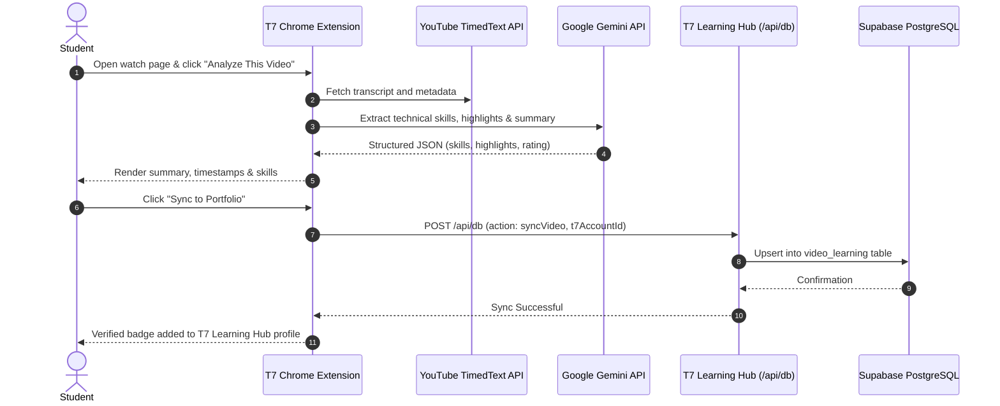

# 🧩 T7 — AI Video Intelligence Chrome Extension

> **Turn unstructured YouTube learning into verified academic and placement portfolio credits.**

The **T7 Chrome Extension** (Manifest V3) bridges online video study with the central **T7 Learning Hub** platform. It analyzes educational videos, extracts technical skills, filters non-technical noise, scores search relevance against student placement goals, and securely synchronizes learning records to Supabase PostgreSQL.

---

## 🚀 Installation (Developer Mode)

1. Open Google Chrome and navigate to `chrome://extensions/`.
2. Enable **Developer mode** using the toggle switch in the top-right corner.
3. Click **"Load unpacked"**.
4. Select the `T7-extension/` directory from this repository.
5. Pin the T7 icon to your Chrome toolbar for quick access.

---

## 🔑 Setup & Account Linking

1. Click the **T7 extension icon** in your Chrome toolbar.
2. Navigate to the **Settings** tab.
3. Enter your **Google Gemini API Key** (available free at [Google AI Studio](https://aistudio.google.com)).
4. Enter your unique **T7 Account ID** (found on your T7 Learning Hub student profile/dashboard).
5. Choose your target **Learning Goal** (e.g. *Frontend Dev*, *Backend Dev*, *Data Science*, *DevOps/Cloud*, *UI/UX Design*).
6. Click **Save Settings**.

---

## ✨ Features Breakdown

### 1. YouTube Search Relevance Overlay (Automatic)
* **AI Rating Badges**: Appears directly over video cards on YouTube search result pages.
* **Goal Match %**: Dynamically calculates how closely the video aligns with your selected career goal (e.g., searching for "React Tutorial" with a Frontend Dev goal scores ~95%, while an unrelated topic shows a low match bar).
* **Quality Score**: Heuristic score (1–5 stars) based on educational density, view-to-engagement metrics, and content structure.
* **One-Line AI Takeaway**: Instant snapshot of what concepts the video covers.

### 2. Video Analysis & Skill Extraction
* Click **"⚡ Analyze This Video"** on any YouTube watch page.
* **Summary**: Concise breakdown of concepts covered.
* **Highlights**: 6 critical moments with clickable timestamps that seek the video directly.
* **Transcript**: Complete synchronized transcript, exportable as TXT or SRT.
* **Smart "Junk" Filtering**: Filters out generic buzzwords ("tutorial", "course", "basics", "introduction") to isolate concrete technical competencies (e.g., *React Hooks*, *Docker*, *PostgreSQL*, *Tailwind CSS*).

### 3. Automated Database Synchronization (`/api/db`)
* Clicking **"Sync"** pushes the video title, URL, duration, summary, and detected technical skills directly to the T7 Learning Hub database gateway (`/api/db` with action `syncVideo`).
* Automatically persists records to the Supabase `video_learning` table associated with your **T7 Account ID**.
* Your student dashboard, profile, and placement readiness score immediately reflect the newly acquired skills.

### 4. Interactive "T7 SKILL_BOT" Companion
* Context-aware floating AI tutor beside the video player.
* Answers questions directly from the video transcript and provides custom practice problems to test retention.

---

## 🎯 Learning Goals & Dynamic Weights

The relevance scoring engine adapts based on your selected target discipline:

| Learning Goal | Prioritized Technical Topics |
|---|---|
| **Frontend Dev** | HTML5, CSS3, JavaScript (ES6+), TypeScript, React, Next.js, Tailwind CSS, Vue |
| **Backend Dev** | Node.js, Express, Python, Django, FastAPI, REST APIs, GraphQL, PostgreSQL, Redis |
| **Data Science** | Python, NumPy, Pandas, Scikit-Learn, PyTorch, TensorFlow, SQL, Data Pipelines |
| **DevOps / Cloud** | Docker, Kubernetes, CI/CD Actions, AWS, GCP, Terraform, Linux, Microservices |
| **UI/UX Design** | Figma, Design Systems, Wireframing, UX Research, Heuristic Evaluation, Accessibility |

---

## 📁 Architecture & File Structure

```
T7-extension/
├── manifest.json       — Manifest V3 configuration, permissions, and host specifications
├── background.js       — Service worker managing Gemini API calls and /api/db database syncing
├── content.js          — DOM script injected into YouTube for badge overlays and caption scraping
├── content.css         — Glassmorphism styles and dark-mode badges for YouTube search UI
├── popup.html          — Multi-tab extension popup (Analyze, Highlights, Chat, Search, Settings)
├── popup.js            — Popup UI logic, local storage synchronization, and IPC messaging
└── icons/              — 16x16, 48x48, and 128x128 extension icons
```

### Component Roles

- **`manifest.json`**: Restricts permissions to YouTube host domains (`https://www.youtube.com/*`) and Google Gemini API endpoints.
- **`background.js`**: Background service worker handling asynchronous Gemini requests to prevent UI freezing, and communicating with the central `/api/db` endpoint.
- **`content.js` / `content.css`**: Injected on YouTube navigation to parse video metadata, extract subtitles from the YouTube timedtext API, and render goal-match badges over thumbnails.
- **`popup.js`**: Interacts with `chrome.storage.local` to safely retain your Gemini API key and T7 Account ID without remote transmission.

---

## 🔒 Security & Privacy

* **Local Secret Storage**: Your Gemini API key is stored strictly on your device inside `chrome.storage.local`. It is never uploaded to T7 Learning Hub servers.
* **No Authentication Overhead**: The extension identifies accounts solely via your public **T7 Account ID**, preventing session hijacking or credential exposure.
* **Transparent Network Activity**: Network traffic is strictly limited to Google AI Studio, YouTube caption services, and the verified `/api/db` sync endpoint.

---

## 🔄 End-to-End Workflow


