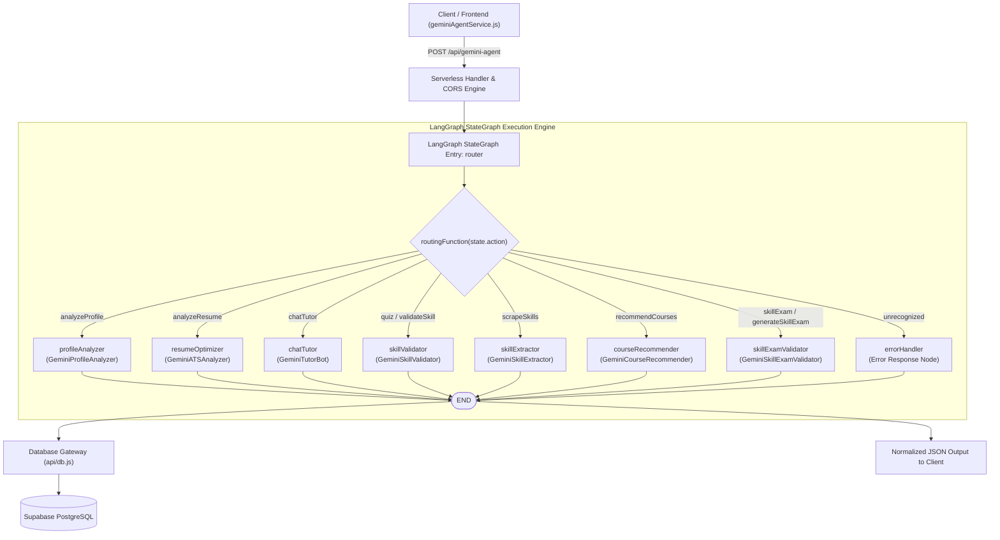
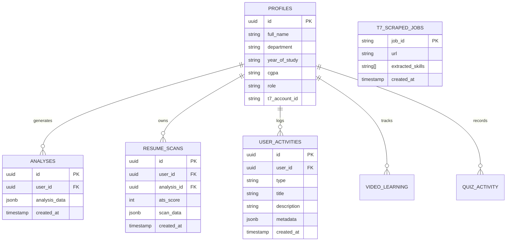

# T7 Learning Hub: LangChain & LangGraph Multi-Agent Architecture

## Executive Summary

The **T7 Learning Hub** AI orchestration engine is built on **LangChain** (`@langchain/core`, `@langchain/google-genai`) and **LangGraph** (`@langchain/langgraph`), backed by **Google Gemini** models. The architecture provides an enterprise-grade multi-agent system designed for student placement preparation, resume ATS auditing, real-time code challenges, AI mentoring, job skill extraction, course recommendations, and 5-pillar skill certification exams.

The system replaces legacy monolithic `if/else` scripting with a compiled **LangGraph StateGraph** that enforces typed graph channels, deterministic scoring models, multi-model fallback chains, self-healing Zod schema validation, multi-turn conversational session history, and zero-client-secret database persistence.

---

## 1. High-Level Architecture & Directed Graph Topology

All AI interactions enter through the serverless endpoint [`api/gemini-agent.js`](file:///d:/Projects%20Working%20in%20Progress/T7LEARNING_HUB(USEReady%20Edition)/T7-Learning-Hub/api/gemini-agent.js), which invokes a compiled LangGraph `StateGraph`.

### Graph Topology



### Architectural Highlights

| Dimension | Implementation Details |
|---|---|
| **Graph Framework** | LangGraph `StateGraph` with explicit channel schemas and conditional edges |
| **Model Runtime** | `@langchain/google-genai` with primary + multi-model `.withFallbacks()` |
| **Validation Layer** | Zod (`zod@^4.6.5`) with automated repair loop on parse failures |
| **Scoring Determinism** | Dedicated scoring models (`temperature: 0, topK: 1`) for repeatable ATS audit results |
| **Memory / History** | `RunnableWithMessageHistory` + `InMemoryChatMessageHistory` per session ID |
| **Document Processing** | `pdf-parse` (PDF) + `mammoth` (DOCX/DOC) with UTF-8 byte stream sanitizer |
| **Link Integrity** | Real-time YouTube oEmbed verification with auto-healing search query parser |
| **Data Security** | Zero client secrets; Supabase Service Role and Gemini keys reside strictly in server environment |

---

## 2. Graph Channels & Shared State

The `StateGraph` defines a shared state channel schema initialized per request:

```javascript
const graph = new StateGraph({
  channels: {
    action:    { default: () => '' },
    payload:   { default: () => ({}) },
    userId:    { default: () => '' },
    result:    { default: () => null },
    agentName: { default: () => '' },
    error:     { default: () => null },
  },
});
```

### Channel Definitions

- **`action`** (`string`): The operation verb dispatched by the client (e.g. `'analyzeProfile'`, `'analyzeResume'`, `'chatTutor'`, `'quiz'`, `'validateSkill'`, `'scrapeSkills'`, `'recommendCourses'`, `'skillExam'`).
- **`payload`** (`object`): Request parameters including Base64 resumes, target role definitions, student context (branch, CGPA, year), custom keys, model preferences, and session IDs.
- **`userId`** (`string`): Authenticated user identifier (defaults to `'t7_user'` for guest/demo sessions).
- **`result`** (`any`): Normalized structured payload produced by the executing agent node.
- **`agentName`** (`string`): Identifier of the agent node that processed the task (for telemetry and audit trails).
- **`error`** (`string | null`): Populated when an unsupported action is requested or an unrecoverable failure occurs.

---

## 3. Detailed Node Specifications

### Node 0: Router Node & Routing Function

- **Function**: `routerNode(state)` & `routingFunction(state)`
- **Behavior**: Inspects `state.action` and directs the execution token along conditional edges to one of 8 specialized agent nodes or the error handler:
  ```javascript
  function routingFunction(state) {
    const routes = {
      analyzeProfile:    'profileAnalyzer',
      analyzeResume:     'resumeOptimizer',
      chatTutor:         'chatTutor',
      quiz:              'skillValidator',
      validateSkill:     'skillValidator',
      scrapeSkills:      'skillExtractor',
      recommendCourses:  'courseRecommender',
      skillExam:         'skillExamValidator',
      generateSkillExam: 'skillExamValidator',
    };
    return routes[state.action] || 'errorHandler';
  }
  ```

---

### Node 1: Profile Analyzer (`profileAnalyzerNode`)

- **Agent Name**: `GeminiProfileAnalyzer`
- **Trigger Action**: `analyzeProfile`
- **Role**: Senior placement coach and career pathway architect.
- **Input Payload**: `skills`, `role`, `branch`, `year`, `cgpa`, `resumeBase64`, `mimeType`, `preferredModel`, `customApiKey`.
- **Execution Flow**:
  1. If `resumeBase64` is supplied, text is extracted via `extractTextFromBase64`.
  2. Compiles student profile and role requirements (required skills, priority skills, description).
  3. Invokes `createStructuredModel` bound to `ProfileSchema`.
  4. Formats scores and normalizes output into a unified shape expected by the frontend.
- **Zod Schema (`ProfileSchema`)**:
  ```typescript
  {
    career_role: string,
    readiness_score: integer (0 - 100),
    score_breakdown: {
      technical: integer (0 - 100),
      resume: integer (0 - 100),
      market_fit: integer (0 - 100),
      profile_completeness: integer (0 - 100)
    },
    skills_have: string[],
    skills_missing: string[],
    roadmap: Array<{
      phase: integer (1 - 4),
      milestone: string,
      title: string,
      duration_weeks: integer,
      skills_covered: string[]
    }>,
    quick_wins: string[],
    honest_assessment: string,
    final_outcome: string,
    motivation: string
  }
  ```
- **Output Normalization**: Automatically mirrors legacy and modern field names (e.g., `learning_roadmap` and `roadmap`, `matched_skills` and `skills_have`, `missing_skills` and `skills_missing`).

---

### Node 2: Resume Optimizer & ATS Auditor (`resumeOptimizerNode`)

- **Agent Name**: `GeminiATSAnalyzer`
- **Trigger Action**: `analyzeResume`
- **Role**: Expert Applicant Tracking System (ATS) auditor and hiring manager evaluation model.
- **Determinism Constraint**: Uses `createScoringModel` (`temperature: 0, topK: 1, topP: 1`) to guarantee identical scores for the same resume document.
- **Input Payload**: `resumeBase64`, `mimeType`, `targetRole`, `studentContext` (`cgpa`, `year`, `branch`).
- **Scoring Rubric**:
  1. **ATS Parseability (0–100)**: Evaluates core sections (Contact: 15, Summary: 10, Skills: 20, Experience: 25, Education: 20, Certifications: 10) and deducts 5 points per section containing tables, multi-column layouts, or non-parsable artifacts.
  2. **Impact Quantification (0–100)**: Ratio of quantified bullet points containing metrics/KPIs to total bullet points `(quantified / total) * 100`.
  3. **Skill Match (0–100)**: Matches against top 10 required skills for target role `(matched / 10) * 100`.
  4. **Formatting Quality (0–100)**: Base 100 with strict deductions for column breaks (-20), font issues (-15), excessive page counts for freshers (-10), missing section headers (-10), or incomplete contact info (-10).
  5. **Overall Readiness**: Formulaic blend:
     $$\text{overall} = (0.25 \times \text{parseability}) + (0.20 \times \text{quantification}) + (0.35 \times \text{skill\_match}) + (0.20 \times \text{formatting})$$
- **Self-Healing & Auto-Repair Loop**:
  If Gemini's structured response triggers a `ZodError` or `OutputParserException`:
  1. Catches the error and logs diagnostic details.
  2. Constructs an explicit auto-repair prompt highlighting the exact failing validation constraints and the raw model output.
  3. Calls the repair model to produce valid JSON.
  4. If the repair step also fails, gracefully degrades to `GRACEFUL_ATS_FALLBACK` with `partial_result: true`, ensuring zero unhandled client crashes.

---

### Node 3: AI Mentor Chat Tutor (`chatTutorNode`)

- **Agent Name**: `GeminiTutorBot`
- **Trigger Action**: `chatTutor`
- **Role**: Empathetic, highly personalized conversational technical mentor.
- **Stateful Memory**: Employs `RunnableWithMessageHistory` hooked to `InMemoryChatMessageHistory` with unique `sessionId` keys (`sessionStore` map). Accepts prior conversation history arrays to rehydrate sessions on demand.
- **Deep Context Injection (`buildMentorSystemPrompt`)**:
  Dynamically builds an extensive system prompt incorporating:
  - Student basics (Name, Branch, Passout Year, CGPA, Target Role)
  - Career Readiness Metrics (Overall score, honest assessment, goal)
  - Matched vs. Missing skills
  - 4-Phase Roadmap breakdown
  - ATS Resume Scan details (Score, parseability, impact, formatting, strengths, gap points, keywords)
  - YouTube learning progress (analyzed video count and acquired skills)
- **Model Configuration**: Default `gemini-3.6-flash` (balanced reasoning and speed) with `maxOutputTokens: 1024`.

---

### Node 4: Skill Validator & Coding Challenge (`skillValidatorNode`)

- **Agent Name**: `GeminiSkillValidator`
- **Trigger Action**: `quiz` or `validateSkill`
- **Dual-Mode Operation**:
  1. **Evaluation Mode (`mode === 'evaluate'`)**:
     - Triggered when `submittedCode` and `question` are present in payload.
     - Evaluates code logic, time/space complexity, edge cases, and best practices.
     - Returns `QuizEvaluationSchema`: `{ isCorrect: boolean, score: number, feedback: string, optimalSolution: string }`.
  2. **Generation Mode (`mode === 'generate'`)**:
     - Tailored to student's exact skill gaps (`missingSkills`, `matchedSkills`, `targetRole`).
     - Injects a high-entropy seed (`Date.now() + Math.random()`) to eliminate repetitive textbook questions.
     - Generates **5 dynamic questions**:
       - **3 Multiple-Choice Questions (MCQ)**: Conceptual depth, code output prediction, architectural decisions, and bug detection.
       - **2 Hands-on Coding Challenges (`type: 'code'`)**: Realistic coding scenarios with starter code scaffolds, ready for in-browser IDE rendering (e.g. Monaco Editor).
- **Zod Schema (`QuizQuestionsSchema`)**:
  ```typescript
  {
    questions: Array<{
      id: number,
      type: 'mcq' | 'code',
      skill: string,
      language: string,
      title: string,
      description: string,
      startingCode: string,       // Starter code for 'code' type
      codeSnippet: string,        // Code snippet for 'mcq' bug/output questions
      options: string[],          // Exactly 4 options for 'mcq'
      correctAnswerIndex: number, // 0, 1, 2, or 3
      explanation: string         // Pedagogical explanation
    }>
  }
  ```

---

### Node 5: Skill Extractor (`skillExtractorNode`)

- **Agent Name**: `GeminiSkillExtractor`
- **Trigger Action**: `scrapeSkills`
- **Role**: Job Description (JD) text extraction and skill mining.
- **Workflow**:
  1. **Cache Inspection**: Queries Supabase table `t7_scraped_jobs` by `job_id`. Returns cached skill list immediately on cache hit.
  2. **Job Description Scraping**: If un-cached, fetches JD contents using the Python backend scraper (`/scraping/scrape`) with anti-bot/Cloudflare fallback detection.
  3. **Skill Mining**: Dispatches JD text to Gemini structured model with `SkillsSchema` to extract canonical technical skills, frameworks, languages, and tools.
  4. **Cache Writeback**: Upserts the newly extracted skill array into `t7_scraped_jobs`.

---

### Node 6: Course Recommender (`courseRecommenderNode`)

- **Agent Name**: `GeminiCourseRecommender`
- **Trigger Action**: `recommendCourses`
- **Role**: Dynamic, pedagogical course and video recommendation for campus placement preparation.
- **Features**:
  - **In-Memory Cache (`courseCache`)**: Stores previous skill lookups to avoid duplicate token consumption and ensure sub-second response times. Supports `forceRefresh: true` override.
  - **Pedagogical Assessment**: Recommends top-rated masterclasses from platforms like YouTube, freeCodeCamp, MIT OpenCourseWare, Harvard CS50, Coursera, and NPTEL.
  - **Real-Time YouTube oEmbed Validation & Auto-Healing (`ensureValidCourseUrl`)**:
    1. Tests video URLs against YouTube's public oEmbed endpoint `https://www.youtube.com/oembed?url=...`.
    2. If a hallucinated or dead link (HTTP 404) is detected, issues an automated search query: `${skill} ${title} ${instructor} full tutorial course`.
    3. Parses the HTML response for the top video ID (`/watch?v=...`) and automatically heals the URL before sending to the client.
- **Zod Schema (`CoursesListSchema`)**:
  ```typescript
  {
    recommendations: Array<{
      skill: string,
      course_title: string,
      platform: string,
      instructor_channel: string,
      direct_url: string,
      duration: string,
      why_recommended: string,
      key_topics: string[],
      difficulty_level: string
    }>
  }
  ```

---

### Node 7: Skill Certification Exam Validator (`skillExamValidatorNode`)

- **Agent Name**: `GeminiSkillExamValidator`
- **Trigger Action**: `skillExam` or `generateSkillExam`
- **Role**: University placement and industry-standard skill certification exam generator.
- **5 Core Pillars Architecture**:
  Produces exactly **10 scenario-based questions** (2 questions per pillar):
  1. **Pillar 1: Syntax & Idioms**: Language primitives, typing, control flow, keywords.
  2. **Pillar 2: OOP & Paradigms**: Inheritance, interfaces, polymorphism, composition, functional idioms.
  3. **Pillar 3: Collections & Data**: Data structures, transformations, immutability, memory allocation.
  4. **Pillar 4: Concurrency & Async**: Threading, async/await, coroutines, race conditions, event loops.
  5. **Pillar 5: Architecture & Best Practices**: Design patterns, clean architecture, edge cases, error handling, production pitfalls.
- **Zod Schema (`SkillExamSchema`)**:
  Strictly validates 10 questions, each with assigned pillar, question text, optional code snippet, 4 distinct options, correct answer index, and comprehensive explanation.

---

### Node 8: Error Handler (`errorHandlerNode`)

- **Behavior**: Returns structured error feedback when an unsupported action string is passed to the orchestrator:
  ```javascript
  function errorHandlerNode(state) {
    return { error: `Unrecognized action: "${state.action}"`, result: null };
  }
  ```

---

## 4. Shared Model Factory & Fallback Cascade (`api/_langchain/llm.js`)

All LLM calls are routed through factory functions defined in [`api/_langchain/llm.js`](file:///d:/Projects%20Working%20in%20Progress/T7LEARNING_HUB(USEReady%20Edition)/T7-Learning-Hub/api/_langchain/llm.js).

### Model Registry

| Model Key | Display Name | Role / Characterization |
|---|---|---|
| `gemini-3.6-flash` | Gemini 3.6 Flash | Default Balanced Engine |
| `gemini-3.5-flash` | Gemini 3.5 Flash | Stable Fallback / High-Fidelity Structured Task Runner |
| `gemini-3.1-flash-lite` | Gemini 3.1 Flash Lite | High-speed, low-latency execution |
| `gemini-3.7-flash` | Gemini 3.7 Flash | Ultra Fast Reasoning |
| `gemini-3.8-flash` | Gemini 3.8 Flash | Next-Gen Flagship Multi-Agent Processing |
| `gemini-3.1-pro-preview` | Gemini 3.1 Pro Preview | Deep Intelligence (Complex logic & enterprise audits) |

### Fallback Cascades (`.withFallbacks`)

To shield end users from rate limits (HTTP 429), quota exhaustions, or transient timeouts, the factory wraps models in `.withFallbacks()`:

```
Selected Primary Model (e.g. Gemini 3.6 Flash)
       │ (fails or rate limited)
       ▼
   Gemini 3.5 Flash
       │ (fails)
       ▼
   Gemini 3.6 Flash
       │ (fails)
       ▼
   Gemini 3.1 Flash Lite
       │ (fails)
       ▼
   Gemini 3.7 Flash
       │ (fails)
       ▼
   Gemini 3.8 Flash
```

### Factory Methods

- **`createModel(modelId, apiKey, opts)`**: Configures base `ChatGoogleGenerativeAI` instance.
- **`createChatModel(primaryModelId, apiKey, opts)`**: Binds conversational parameters with fallback chain.
- **`createStructuredModel(apiKey, zodSchema, preferredModelId, opts)`**: Binds `.withStructuredOutput(zodSchema)` across primary and all fallback models with `temperature: 0.1` for deterministic JSON.
- **`createScoringModel(apiKey, zodSchema, preferredModelId)`**: Special scoring configuration with `temperature: 0, topK: 1, topP: 1` to ensure identical scoring outputs on identical inputs.
- **`extractTextFromBase64(base64Data, mimeType)`**: Parses PDF documents via `pdf-parse`, Word documents via `mammoth`, and cleans up binary noise with UTF-8 fallback filtering.

---

## 5. Database Gateway & Persistence (`api/db.js`)

The AI outputs are persisted to Supabase PostgreSQL through an enterprise gateway in [`api/db.js`](file:///d:/Projects%20Working%20in%20Progress/T7LEARNING_HUB(USEReady%20Edition)/T7-Learning-Hub/api/db.js).

### Zero-Client-Secrets Policy

All sensitive credentials (`SUPABASE_URL`, `SUPABASE_SERVICE_ROLE_KEY`, `SUPABASE_ANON_KEY`, `GEMINI_API_KEY`) reside exclusively in server-side environment variables. The browser never receives database service tokens.

### Database Interaction Schema



### Automatic Maintenance Policies

1. **Auto-Save Cascade**: When saving a profile assessment (`saveAnalysis`), if ATS scan data is included, the gateway initiates a secondary insert into `resume_scans` and writes an event to `user_activities`.
2. **Resume Scan Pruning**: Prevents database bloat by pruning old scans, automatically retaining only the **2 most recent resume scans** per student.
3. **Local Dev Fallback (`devDb`)**: If Supabase credentials are not configured in local development, `api/db.js` activates an in-memory mock store, enabling local development without cloud dependency.

---

## 6. Client-Side Service Layer (`src/services/geminiAgentService.js`)

The frontend interacts with the LangGraph backend through [`src/services/geminiAgentService.js`](file:///d:/Projects%20Working%20in%20Progress/T7LEARNING_HUB(USEReady%20Edition)/T7-Learning-Hub/src/services/geminiAgentService.js):

### Available Service Functions

| Service Function | Agent Invoked | Primary Purpose |
|---|---|---|
| `analyzeStudentProfile(args)` | `GeminiProfileAnalyzer` | Evaluates placement readiness, produces 4-phase roadmap and quick wins |
| `analyzeResumeGeminiAgent(args)` | `GeminiATSAnalyzer` | Generates deterministic ATS audit, bullet rewrites, and keyword gaps |
| `callGeminiTutor(args)` | `GeminiTutorBot` | Context-aware, multi-turn AI mentor chat with chat history persistence |
| `generateSkillQuiz(args)` | `GeminiSkillValidator` | Generates 3 MCQs + 2 Code challenges with Monaco Editor starter scaffolds |
| `gradeSkillQuiz(args)` | `GeminiSkillValidator` | Grades submitted code solutions with line-by-line feedback |
| `getCourseRecommendations(args)` | `GeminiCourseRecommender` | Retrieves verified YouTube & platform course recommendations |
| `generateSkillCertificationExam(args)` | `GeminiSkillExamValidator` | Produces 10-question 5-pillar skill certification exam |

### Error & Timeout Handling

- **Safe JSON Parsing**: Avoids unhandled JSON parsing exceptions by validating HTTP status codes and inspecting error bodies.
- **Serverless Timeout Detection**: Detects HTTP 504 and `FUNCTION_INVOCATION_TIMEOUT` strings to advise the user when complex models encounter latency.
- **Quota Interception**: Traps HTTP 429 quota errors and formats friendly notifications regarding daily Gemini quota resets.

---

## 7. Observability & LangSmith Tracing

The LangChain/LangGraph engine supports native LangSmith tracing. Enabling tracing requires adding environment variables in `.env`:

```bash
# LangSmith Observability
LANGCHAIN_TRACING_V2=true
LANGCHAIN_API_KEY=lsv2_pt_...
LANGCHAIN_PROJECT=t7-learning-hub-production
```

When enabled, LangSmith logs:
- Complete execution graph step latency across each node.
- Input and output tokens consumed per Gemini model invocation.
- Automatic fallback trigger events and schema repair operations.
- Runnable message histories and conversational session memory graphs.
