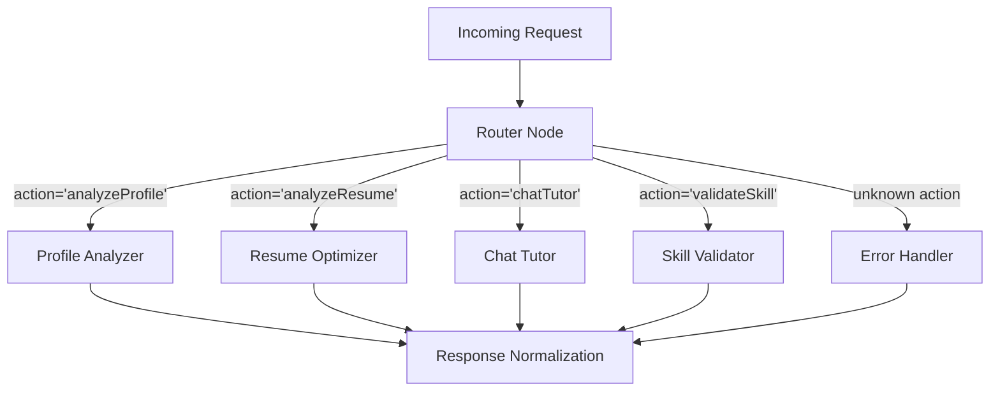

# T7 Learning Hub: LangChain & LangGraph Architecture

This document outlines the modern multi-agent AI architecture of the T7 Learning Hub. The system recently migrated from a monolithic legacy `if/else` based routing system (formerly reliant on `lyzr`) to a robust, node-based **LangGraph StateGraph** powered by **LangChain** and **Google Gemini**.

## 1. High-Level Architecture
The AI backend (`/api/lyzr.js`) operates as a directed graph where each request flows through a series of specialized nodes.

**Graph Shape:**


### Key Benefits over the Legacy System:
- **Node Isolation:** Each agent is a fully isolated graph node, making it easier to test and modify without side-effects.
- **Typed Shared State:** Eliminates guessing what data is available at each step.
- **Structured Outputs:** Uses LangChain's `.withStructuredOutput()` coupled with **Zod** schemas to guarantee consistent JSON formats. This eliminates manual normalization code.
- **Automatic Tracing:** Fully compatible with LangSmith for logging every token, latency, and prompt (via `LANGCHAIN_TRACING_V2`).
- **Cost Efficiency:** Directly interfaces with Gemini, removing middleman dependencies.

---

## 2. Core Components

### A. Shared Agent State (`AgentState`)
Every node in the graph reads from and writes to a single shared state object.
```javascript
const INITIAL_STATE = {
  action:         '',   // e.g., 'analyzeProfile', 'chatTutor'
  payload:        {},   // Raw request payload containing user context/resumes
  userId:         '',   // Identifier for the user
  result:         null, // Final normalized result (populated by agent)
  agentName:      '',   // Name of the agent that handled the request
  error:          null, // Populated if something goes wrong
};
```

### B. The LangGraph Nodes (`api/lyzr.js`)

#### 1. Router Node (`routerNode` & `routingFunction`)
The entry point of the graph. It inspects `state.action` and uses a `ConditionalEdge` to map the request to the correct specific agent node. If the action is unrecognized, it routes to the `errorHandler`.

#### 2. Profile Analyzer Node (`profileAnalyzerNode`)
- **Purpose:** Acts as a senior career coach. Evaluates a student's branch, CGPA, and resume to provide a readiness score and a learning roadmap.
- **Mechanism:** Uses `createStructuredModel` mapped to the `ProfileSchema` (Zod). 
- **Output:** Returns a strictly formatted JSON containing `readiness_score`, `skills_missing`, `roadmap`, and `quick_wins`.

#### 3. Resume Optimizer Node (`resumeOptimizerNode`)
- **Purpose:** Acts as an expert ATS auditor.
- **Mechanism:** Extracts text from a Base64-encoded file (PDF/Docx), then invokes `createStructuredModel` with the `ResumeSchema`.
- **Output:** Returns `ats_score`, `strengths`, `gaps`, ATS `rewrites`, and `keyword_gaps`.

#### 4. Chat Tutor Node (`chatTutorNode`)
- **Purpose:** Acts as the T7 AI Tutor for conversational Q&A.
- **Mechanism:** Uses standard LangChain primitives (`ChatPromptTemplate` -> `Model` -> `StringOutputParser`). It injects student context (branch, year, readiness) into the prompt dynamically.
- **Output:** Returns plain text responses.

#### 5. Skill Validator Node (`skillValidatorNode`)
- **Purpose:** Evaluates or generates skill quizzes.
- **Mechanism:** Dual-purpose prompt logic. If `answers` are provided in the payload, it grades the quiz. If not, it generates 5 multiple-choice questions for the requested skill level.
- **Output:** Returns a JSON structure mapping to `SkillQuizSchema`.

---

## 3. LangChain Model Factory (`api/_langchain/llm.js`)

This file abstracts LLM instantiations to enforce uniformity, reliability, and fallback strategies.

- **`MODEL_REGISTRY`:** Maintains a list of available Gemini models (e.g., `gemini-3.1-pro-preview`, `gemini-3.8-flash`).
- **Automatic Fallbacks (`.withFallbacks`)**: If the primary model fails (e.g., rate limits), it automatically downgrades to a faster/cheaper model (like `gemini-3.5-flash`) so the user never sees an error.
- **`createStructuredModel`**: Optimized for JSON output. Uses `temperature: 0.1` to reduce hallucination of keys.
- **`createScoringModel`**: Specifically designed for deterministic ATS grading. Uses `temperature: 0, topK: 1, topP: 1` so that given the exact same resume, the LLM outputs the exact same ATS score every time.
- **Text Extraction:** Uses `mammoth` (for Word docs) and `pdf-parse` (for PDFs) to safely extract text from Base64 strings before sending them to the LLM context window.

---

## 4. Database Gateway & Persistence (`api/db.js`)

Once the LangGraph agents generate their insights, the data is pushed to a Supabase PostgreSQL backend via `/api/db.js`. 

**Key Details:**
- **Zero Client Secrets:** The Supabase URL and Service Role Key are strictly kept on the server side (`process.env`). The frontend never talks to the DB directly.
- **Auto-Saving:** When a profile analysis is saved (`saveAnalysis`), if an ATS scan is attached, the DB gateway automatically spawns a secondary insert into `resume_scans` and logs an event into `user_activities`.
- **History Pruning:** To save space, the `saveResumeScan` action implements an auto-cleanup block that deletes old resume scans, retaining only the 2 most recent for a user.
- **Local Dev Fallback:** If Supabase credentials are missing (e.g., during local development), `db.js` gracefully degrades into an *in-memory* mock database (`devDb`), allowing developers to test LangGraph without needing cloud infrastructure.
